## 介绍

- 邮箱：

   gaofeng_zgf@163.com


- 编译：

  Markdown编辑器使用[Typora](https://typora.io/)

  主题使用[Drake](https://theme.typora.io/theme/Drake/)

  

- 其他链接：

  [菜鸟学习Java-从入门到跑路](https://github.com/Nicolas-gaofeng/Salute_Java)

  [菜鸟学习Python-从入门到跑路](https://github.com/Nicolas-gaofeng/Salute_Python)

  [菜鸟学习算法-从入门到跑路](https://github.com/Nicolas-gaofeng/Salute_Algorithm)

  [菜鸟学习机器学习-从入门到跑路](https://github.com/Nicolas-gaofeng/Salute_Machine_Learning)

  [菜鸟学习深度学习-从入门到跑路](https://github.com/Nicolas-gaofeng/Salute_Deep_Learning)

  

- 个人声明：

  这是一份学习Git的菜鸟教程-从入门到跑路。

  如果本仓库存在的内容对您和您的利益产生损害，请立即私信我们，我们将在最短时间内对其做出删除处理。

  大家有问题，欢迎与我交流、分享，我期待你的来电！


- 鸣谢：

  如果文中出现错误，请与我联系。如果建议或提议十分不错，予以采纳，我将给予适当的物质奖励，并将你纳入贡献者名单！提出小错误或小的建议也是OK的哦，也会纳入名单的哦！期待你的来信！

## 目录

* [介绍](#介绍)
* [目录](#目录)
* [下载与安装](#下载与安装)
* [一、Git概述](#一git概述)
  * [1\.1 Git的前世今生](#11-git的前世今生)
  * [1\.2 Git特点](#12-git特点)
  * [1\.3 Git与SVN对比](#13-git与svn对比)
    * [SVN](#svn)
    * [Git](#git)
  * [1\.4 Git工作流程](#14-git工作流程)
  * [1\.5 工作目录、暂存区以及版本库概念](#15-工作目录暂存区以及版本库概念)
  * [1\.6 Git工作目录下文件的两种状态](#16-git工作目录下文件的两种状态)
* [二、Git代码托管服务](#二git代码托管服务)
  * [2\.1 码云（Gitee）](#21-码云gitee)
  * [2\.2 GitHub](#22-github)
  * [2\.3 GitLab](#23-gitlab)
* [三、Git常用命令](#三git常用命令)
  * [3\.1 环境配置](#31-环境配置)
    * [3\.1\.1 查看配置信息](#311-查看配置信息)
    * [3\.1\.2 设置用户信息](#312-设置用户信息)
  * [3\.2 获取Git仓库](#32-获取git仓库)
    * [3\.2\.1 在本地初始化一个Git仓库](#321-在本地初始化一个git仓库)
    * [3\.2\.2 从远程仓库克隆](#322-从远程仓库克隆)
  * [3\.3 本地仓库操作](#33-本地仓库操作)
    * [3\.3\.1 查看文件状态](#331-查看文件状态)
    * [3\.3\.2 将未跟踪的文件加入暂存区](#332-将未跟踪的文件加入暂存区)
    * [3\.3\.3 将暂存区的文件取消暂存](#333-将暂存区的文件取消暂存)
    * [3\.3\.4 将暂存区的文件修改提交到本地仓库](#334-将暂存区的文件修改提交到本地仓库)
    * [3\.3\.5 删除文件](#335-删除文件)
    * [3\.3\.6 将文件添加至忽略列表](#336-将文件添加至忽略列表)
    * [3\.3\.7 查看日志记录](#337-查看日志记录)
    * [3\.3\.8 回退到某个版本](#338-回退到某个版本)
  * [3\.4 远程仓库操作](#34-远程仓库操作)
    * [3\.4\.1 查看远程仓库](#341-查看远程仓库)
    * [3\.4\.2 添加远程仓库](#342-添加远程仓库)
    * [3\.4\.3 从远程仓库克隆](#343-从远程仓库克隆)
    * [3\.4\.4 移除无效的远程仓库](#344-移除无效的远程仓库)
    * [3\.4\.5 从远程仓库中抓取与拉取](#345-从远程仓库中抓取与拉取)
    * [3\.4\.6 推送到远程仓库](#346-推送到远程仓库)
  * [3\.5 Git分支](#35-git分支)
    * [3\.5\.1 概念](#351-概念)
    * [3\.5\.2 查看分支](#352-查看分支)
    * [3\.5\.3 创建分支](#353-创建分支)
    * [3\.5\.4 切换分支](#354-切换分支)
    * [3\.5\.5 创建\+切换分支](#355-创建切换分支)
    * [3\.5\.6 推送至远程仓库分支](#356-推送至远程仓库分支)
    * [3\.5\.7 从远程分支上拉取代码](#357-从远程分支上拉取代码)
    * [3\.5\.8 将本地分支跟踪服务器分支](#358-将本地分支跟踪服务器分支)
    * [3\.5\.9 合并分支](#359-合并分支)
    * [3\.5\.10 删除分支](#3510-删除分支)
    * [3\.5\.11 Bug分支](#3511-bug分支)
  * [3\.6 Git标签](#36-git标签)
    * [3\.6\.1 列出已有的标签](#361-列出已有的标签)
    * [3\.6\.2 查看tag信息](#362-查看tag信息)
    * [3\.6\.3 创建新标签](#363-创建新标签)
    * [3\.6\.4 将标签推送至远程仓库](#364-将标签推送至远程仓库)
    * [3\.6\.5 检出标签](#365-检出标签)
    * [3\.6\.6 删除标签](#366-删除标签)
    * [3\.6\.7 删除远程标签](#367-删除远程标签)
* [四、使用TortoiseGit管理文件版本](#四使用tortoisegit管理文件版本)
  * [4\.1 创建仓库](#41-创建仓库)
  * [4\.2 克隆仓库](#42-克隆仓库)
  * [4\.3 将文件添加到暂存区](#43-将文件添加到暂存区)
  * [4\.4 提交文件](#44-提交文件)
  * [4\.5 推送本地仓库至远程仓库](#45-推送本地仓库至远程仓库)
  * [4\.6 拉取代码](#46-拉取代码)
  * [4\.7 创建分支](#47-创建分支)
  * [4\.8 切换分支](#48-切换分支)
  * [4\.9 合并分支](#49-合并分支)
* [五、在IDEA中使用Git](#五在idea中使用git)
  * [5\.1 在IDEA中配置Git](#51-在idea中配置git)
  * [5\.2 在IDEA中使用Git](#52-在idea中使用git)
    * [5\.2\.1 在IDEA中创建工程并将工程添加至Git](#521-在idea中创建工程并将工程添加至git)
    * [5\.2\.2 将文件添加到暂存区](#522-将文件添加到暂存区)
    * [5\.2\.3 提交文件](#523-提交文件)
    * [5\.2\.4 将代码推送到远程仓库](#524-将代码推送到远程仓库)
    * [5\.2\.5 从远程仓库克隆工程到本地](#525-从远程仓库克隆工程到本地)
    * [5\.2\.6 从远程拉取代码](#526-从远程拉取代码)
    * [5\.2\.7 版本对比](#527-版本对比)
    * [5\.2\.8 创建分支](#528-创建分支)
    * [5\.2\.9 切换分支](#529-切换分支)
    * [5\.2\.10 分支合并](#5210-分支合并)
* [六、使用SSH协议传输数据](#六使用ssh协议传输数据)
  * [6\.1 Git支持的传输协议](#61-git支持的传输协议)
  * [6\.2 什么是SSH协议](#62-什么是ssh协议)
  * [6\.3 配置SSH协议](#63-配置ssh协议)
* [七、使用GitHub](#七使用github)
  * [7\.1 创建仓库](#71-创建仓库)
  * [7\.2 添加ssh账户](#72-添加ssh账户)
  * [7\.3 自动生成README\.md目录](#73-自动生成readmemd目录)
  * [7\.4 怎么删除某个文件夹](#74-怎么删除某个文件夹)
* [八、工作使用git](#八工作使用git)

## 下载与安装

- windows安装

1.[Git](https://git-scm.com/download/win)

2.[Tortoisegit](https://tortoisegit.org/download/)

- Linux安装命令：

  ```
  sudo apt-get install git
  ```

## 一、Git概述 

### 1.1 Git的前世今生

- 今生：

  git是目前世界上最先进的分布式版本控制系统。

- 前世：

  Git 诞生于一个极富纷争大举创新的年代。Linus Torvalds 在1991年创建了开源的Linux，从此，Linux系统不断发展，已经成为最大的服务器系统软件了。Linus虽然创建了Linux，但Linux的壮大是靠全世界热心的志愿者参与的，这么多人在世界各地为Linux编写代码，那Linux的代码是如何管理的呢？事实是，在2002年以前，世界各地的志愿者把源代码文件通过diff的方式发给Linus，然后由Linus本人通过手工方式合并代码！

  你也许会想，为什么Linus不把Linux代码放到版本控制系统里呢？不是有CVS、SVN这些免费的版本控制系统吗？因为Linus坚定地反对CVS和SVN，这些集中式的版本控制系统不但速度慢，而且必须联网才能使用。有一些商用的版本控制系统，虽然比CVS、SVN好用，但那是付费的，和Linux的开源精神不符。不过，到了2002年，Linux系统已经发展了十年了， 绝大多数的 Linux 内核维护工作都花在了提交补丁和保存归档的繁琐事务上（1991－2002年间）。 代码库之大让Linus很难继续通过手工方式管理了，社区的弟兄们也对这种方式表达了强烈不满，于是Linus选择了一个商业的版本控制系统BitKeeper，BitKeeper的东家BitMover公司出于人道主义精神，授权Linux社区免费使用这个版本控制系统。

  安定团结的大好局面在2005年就被打破了，原因是Linux社区牛人聚集，不免沾染了一些梁山好汉的江湖习气。开发Samba的Andrew试图破解BitKeeper的协议(这么干的其实也不只他一个)，被BitMover公司发现了(监控工作做得不错！)，于是BitMover公司怒了，要收回Linux社区的免费使用权。Linus可以向BitMover公司道个歉，保证以后严格管教弟兄们，嗯，这是不可能的，在2005年，开发 BitKeeper 的商业公司同 Linux 内核开源社区的合作关系结束，他们收回了 Linux 内核社区免费使用 BitKeeper 的权力。
  
  实际情况是这样的：Linus花了两周时间自己用C写了一个分布式版本控制系统，Linus对新的系统制订了若干目标：速度;简单的设计;对非线性开发模式的强力支持（允许成千上万个并行开发的分支）;完全分布式;有能力高效管理类似 Linux 内核一样的超大规模项目（速度和数据量）等，这就是Git！一个月之内，Linux系统的源码已经由Git管理了！牛是怎么定义的呢？大家可以体会一下。Git迅速成为最流行的分布式版本控制系统，尤其是2008年，GitHub网站上线了，它为开源项目免费提供Git存储，无数开源项目开始迁移至GitHub，包括jQuery，PHP，Ruby等等。历史就是这么偶然，如果不是当年BitMover公司威胁Linux社区，可能现在我们就没有免费而超级好用的Git了。

### 1.2 Git特点

- 版本控制：
  - 可以解决多人同时开发的代码问题，也可以解决找回历史代码的问题。
- 分布式：
  - Git是分布式版本控制系统，同一个Git仓库，可以分布到不同的机器上。首先找一台电脑充当服务器的角色，每天24小时开机，其他每个人都从这个“服务器”仓库克隆一份到自己的电脑上，并且各自把各自的提交推送到服务器仓库里，也从服务器仓库中拉取别人的提交。可以自己搭建这台服务器，也可以使用GitHub网站。

### 1.3 Git与SVN对比

#### SVN

是集中式版本控制系统，版本库是集中放在中央服务器的，而开发人员工作的时候，用的都是自己的电脑，所以首先要从中央服务器下载最新的版本，然后开发，开发完后，需要把自己开发的代码提交到中央服务器。

集中式版本控制工具缺点：

- ​	服务器单点故障

- ​	容错性差

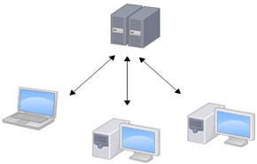

#### Git

是分布式版本控制系统（Distributed Version Control System，简称 DVCS） ，分为两种类型的仓库：本地仓库和远程仓库。

- 本地仓库：是在开发人员自己电脑上的Git仓库
- 远程仓库：是在远程服务器上的Git仓库
- Clone：克隆，就是将远程仓库复制到本地
- Push：推送，就是将本地仓库代码上传到远程仓库
- Pull：拉取，就是将远程仓库代码下载到本地仓库

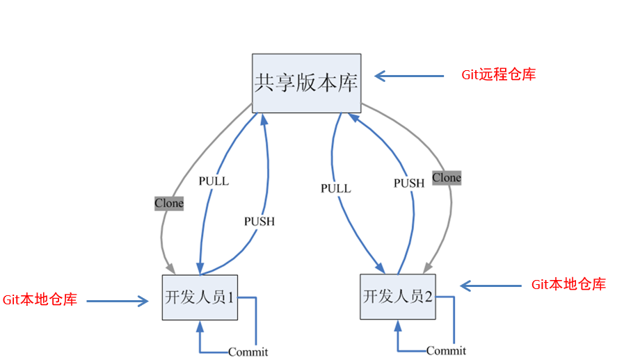

### 1.4 Git工作流程

工作流程如下：

1．从远程仓库中克隆代码到本地仓库

2．从本地仓库中checkout代码然后进行代码修改

3．在提交前先将代码提交到暂存区

4．提交到本地仓库。本地仓库中保存修改的各个历史版本

5．修改完成后，需要和团队成员共享代码时，将代码push到远程仓库

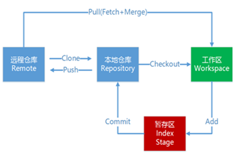

### 1.5 工作目录、暂存区以及版本库概念

- 版本库
  - 前面看到的.git隐藏文件夹就是版本库，版本库中存储了很多配置信息、日志信息和文件版本信息等
- 工作目录（工作区）
  - 包含.git文件夹的目录就是工作目录，主要用于存放开发的代码
- 暂存区
  - .git文件夹中有很多文件，其中有一个index文件就是暂存区，也可以叫做stage。暂存区是一个临时保存修改文件的地方，还有git为我们自动创建的第一个分支master，以及指向master的一个指针叫HEAD。因为我们创建git版本库时，git自动为我们创建了唯一一个master分支，所以，现在，git commit就是往master分支上提交更改。你可以简单理解为，需要提交的文件修改通通放到暂存区，然后，一次性提交暂存区的所有修改。


### 1.6 Git工作目录下文件的两种状态

Git工作目录下的文件存在两种状态：

- untracked 未跟踪（未被纳入版本控制）
- tracked 已跟踪（被纳入版本控制）
  - Unmodified 未修改状态
  - Modified 已修改状态
  - Staged 已暂存状态

这些文件的状态会随着我们执行Git的命令发生变化

## 二、Git代码托管服务

如何搭建Git远程仓库呢？我们可以借助互联网上提供的一些代码托管服务来实现，其中比较常用的有GitHub、码云、GitLab等。

### 2.1 码云（Gitee）

- 地址： https://gitee.com/
- 是国内的一个代码托管平台，由于服务器在国内，所以相比于GitHub，码云速度会更快

### 2.2 GitHub

- 地址：https://github.com/ 
- 是一个面向开源及私有软件项目的托管平台，因为只支持Git 作为唯一的版本库格式进行托管，故名gitHub

### 2.3 GitLab

- 地址： https://about.gitlab.com/
- 是一个用于仓库管理系统的开源项目，使用Git作为代码管理工具，并在此基础上搭建起来的web服务

## 三、Git常用命令

### 3.1 环境配置

当安装Git后首先要做的事情是设置用户名称和email地址。这是非常重要的，因为每次Git提交都会使用该用户信息

#### 3.1.1 查看配置信息

```
git config --list

git config user.name

git config user.email
```

#### 3.1.2 设置用户信息 

```
git config --global user.name “***”

git config --global user.email “*******@qq.cn”
```

通过上面的命令设置的信息会保存在~/.gitconfig文件中

### 3.2 获取Git仓库

要使用Git对我们的代码进行版本控制，首先需要获得Git仓库。获取Git仓库通常有两种方式：

#### 3.2.1 在本地初始化一个Git仓库

执行步骤如下：

1. 在电脑的任意位置创建一个空目录（例如repo1）作为我们的本地Git仓库

2. 进入这个目录中，点击右键打开Git bash窗口

3. 执行命令

   ```
   git init
   ```

如果在当前目录中看到.git文件夹（此文件夹为隐藏文件夹）则说明Git仓库创建成功


#### 3.2.2 从远程仓库克隆

可以通过Git提供的命令从远程仓库进行克隆，将远程仓库克隆到本地

命令形式为：

```
git clone 远程Git仓库地址 
```

### 3.3 本地仓库操作

#### 3.3.1 查看文件状态

```
git status 
git status –s   # 使输出信息更加简洁
```

#### 3.3.2 将未跟踪的文件加入暂存区

```
git add 文件名
```

#### 3.3.3 将暂存区的文件取消暂存

git reset 文件名 将暂存区的文件取消暂存

场景1：当你改乱了工作区某个文件的内容，想直接丢弃工作区的修改时，用命令git checkout -- file。

场景2：当你不但改乱了工作区某个文件的内容，还添加到了暂存区时，想丢弃修改，分两步，第一步用命令git reset HEAD file，就回到了场景1，第二步按场景1操作。用命令git reset HEAD file可以把暂存区的修改撤销掉，重新放回工作区。

场景3：已经提交了不合适的修改到版本库时，想要撤销本次提交，参考版本回退一节。

```
git checkout -- <文件> 
git reset 文件名
git reset HEAD file
```

#### 3.3.4 将暂存区的文件修改提交到本地仓库

```
git commit -m "随便的日志信息str"
```

如果不加 -m会进入编辑器 输入 i 变成插入模式，然后按esc  输入：wq 退出

#### 3.3.5 删除文件

```
git rm 文件名
git commit -m "str"
```

上面删除的只是工作区的文件，需要提交到本地仓库（git commit -m "str"）,rm命令默认将文件添加到暂存区，而直接通过右键删除的方式没有将文件添加到暂存区，需要手动添加文件到暂存区之后（git add 文件名）才能commit。

命令git rm用于删除一个文件。如果一个文件已经被提交到版本库，那么你永远不用担心误删，但是要小心，你只能恢复文件到最新版本，你会丢失最近一次提交后你修改的内容。

找回删错的文件

```
git checkout – 文件名
例
git checkout – code2.txt
```


#### 3.3.6 将文件添加至忽略列表

一般我们总会有些文件无需纳入Git 的管理，也不希望它们总出现在未跟踪文件列表。 通常都是些自动生成的文件，比如日志文件，或者编译过程中创建的临时文件等。 在这种情况下，我们可以在工作目录中创建一个名为 .gitignore 的文件（文件名称固定），列出要忽略的文件模式。下面是一个示例：

windows下 .gitignore文件的创建方式，右键Git bush here里输入touch .gitignore 

```
# no .a files
*.a
# but do track lib.a, even though you're ignoring .a files above
!lib.a
# only ignore the TODO file in the current directory, not subdir/TODO
/TODO
# ignore all files in the build/ directory
build/
# ignore doc/notes.txt, but not doc/server/arch.txt
doc/*.txt
# ignore all .pdf files in the doc/ directory
doc/**/*.pdf
```

#### 3.3.7 查看日志记录

```
 git log 
```

按回车查看信息，出现end代表显示完毕。按q可以退出log页面

#### 3.3.8 回退到某个版本

其中HEAD表示当前最新版本，HEAD^表示当前版本的前一个版本,HEAD^^表示当前版本的前前个版本，也可以使用HEAD~1表示当前版本的前一个版本,HEAD~100表示当前版本的前100版本。

```
git reset --hard HEAD^
git reset --hard 版本号
git reflog  命令可以查看我们的操作记录
```

### 3.4 远程仓库操作

####   3.4.1 查看远程仓库

如果想查看已经配置的远程仓库服务器，可以运行 git remote 命令。 它会列出指定的每一个远程服务器的简写。 如果已经克隆了远程仓库，那么至少应该能看到 origin ，这是 Git 克隆的仓库服务器的默认名字

```
 git remote 
 git remote -v # 显示远程地址 fetch代表抓取 push代表推送
 git remote show origin # 显示更详细的信息
```

####   3.4.2 添加远程仓库

运行 git remote add <shortname> <url> 添加一个新的远程 Git 仓库，同时指定一个可以引用的简写。远程仓库的名称跟本地仓库名称可以不一致，但最好一致。一个本地仓库可以添加多个远程地址。

```
git remote add <shortname> <url>      
git remote add origin <url>      
```

####   3.4.3 从远程仓库克隆

如果你想获得一份已经存在了的 Git 仓库的拷贝，这时就要用到 git clone 命令。 Git 克隆的是该 Git 仓库服务器上的几乎所有数据（包括日志信息、历史记录等），而不仅仅是复制工作所需要的文件。 当你执行 git clone 命令的时候，默认配置下远程 Git 仓库中的每一个文件的每一个版本都将被拉取下来。

克隆仓库的命令格式是 git clone [url] 

```
git clone [url] 
```

####   3.4.4 移除无效的远程仓库

如果因为一些原因想要移除一个远程仓库 ，可以使用

```
git remote rm 名称
```

注意：此命令只是从本地移除远程仓库的记录，并不会真正影响到远程仓库，远程仓库还是存在的

####   3.4.5 从远程仓库中抓取与拉取 

git fetch 是从远程仓库获取最新版本到本地仓库，不会自动merge

```
git fetch
git fetch origin master # 从origin仓库抓取master分支数据
git merge origin/master # 通过git merge手动合并
```

git pull 是从远程仓库获取最新版本并merge到本地仓库

```
git pull
```

注意：如果当前本地仓库不是从远程仓库克隆，而是本地创建的仓库，并且仓库中存在文件，此时再从远程仓库拉取文件的时候会报错（fatal: refusing to merge unrelated histories ），解决此问题可以在git pull命令后加入参数--allow-unrelated-histories

```
git pull --allow-unrelated-histories
```

要求输入日志时直接输入 :wq！退出即可。

####   3.4.6 推送到远程仓库 

当你想分享你的代码时，可以将其推送到远程仓库。 命令形式：

```
git push [remote-name][branch-name]
```

### 3.5 Git分支

#### 3.5.1 概念

几乎所有的版本控制系统都以某种形式支持分支。使用分支意味着你可以把你的工作从开发主线上分离开来，以免影响开发主线。Git的master分支并不是一个特殊分支。 它跟其它分支没有区别。 之所以几乎每一个仓库都有 master 分支，是因为git init 命令默认创建它，并且大多数人都懒得去改动它。

分支就是科幻电影里面的平行宇宙，当你正在电脑前努力学习Git的时候，另一个你正在另一个平行宇宙里努力学习SVN。

如果两个平行宇宙互不干扰，那对现在的你也没啥影响。不过，在某个时间点，两个平行宇宙合并了，结果，你既学会了git又学会了SVN！

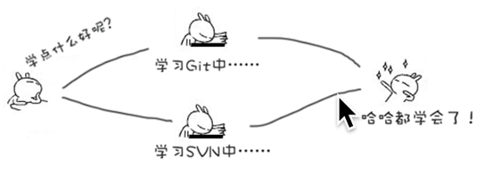

分支在实际中有什么用呢？假设你准备开发一个新功能，但是需要两周才能完成，第一周你写了50%的代码，如果立刻提交，由于代码还没写完，不完整的代码库会导致别人不能干活了。如果等代码全部写完再一次提交，又存在丢失每天进度的巨大风险。

现在有了分支，就不用怕了。你创建了一个属于你自己的分支，别人看不到，还继续在原来的分支上正常工作，而你在自己的分支上干活，想提交就提交，直到开发完毕后，再一次性合并到原来的分支上，这样，既安全，又不影响别人工作。

#### 3.5.2 查看分支 

执行 git branch 命令可以查看当前有几个分支并且看到在哪个分支下工作。

\# 列出所有本地分支 

```
$ git branch
```

\# 列出所有远程分支

```
$ git branch -r
```

\# 列出所有本地分支和远程分支

```
$ git branch -a
```

#### 3.5.3 创建分支

git把我们之前每次提交的版本串成一条时间线，这条时间线就是一个分支。截止到目前只有一条时间线，在git里，这个分支叫主分支，即master分支。HEAD严格来说不是指向提交，而是指向master，master才是指向提交的，所以，HEAD指向的就是当前分支。

(1) 一开始的时候，master分支是一条线，git用master指向最新的提交，再用HEAD指向master，就能确定当前分支，以及当前分支的提交点：

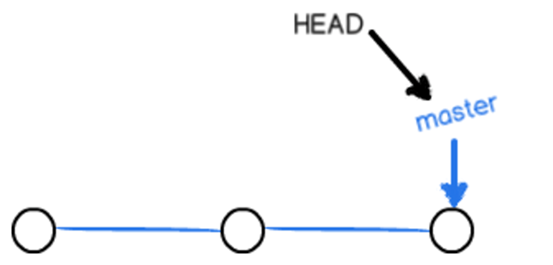

每次提交，master分支都会向前移动一步，这样，随着你不断提交，master分支的线也越来越长。

(2)当我们创建新的分支，例如dev时，git新建了一个指针叫dev，指向master相同的提交，再把HEAD指向dev，就表示当前分支在dev上：

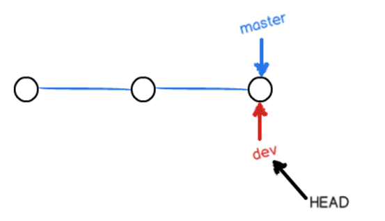

git创建一个分支很快，因为除了增加一个dev指针，改变HEAD的指向，工作区的文件都没有任何变化。

(3)不过，从现在开始，对工作区的修改和提交就是针对dev分支了，比如新提交一次后，dev指针往前移动一步，而master指针不变：

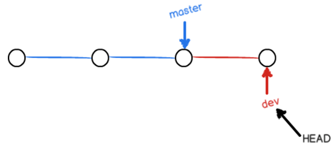

(4)假如我们在dev上的工作完成了，就可以把dev合并到master上。git怎么合并呢？最简单的方法，就是直接把master指向dev的当前提交，就完成了合并：

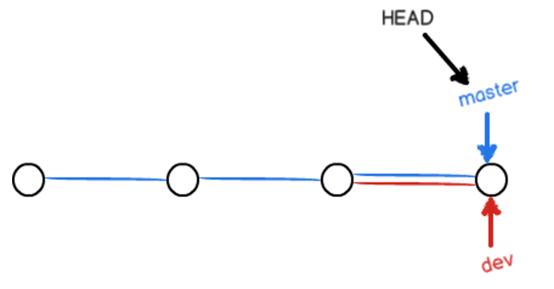

git合并分支也很快，就改改指针，工作区内容也不变。

(5)合并完分支后，甚至可以删除dev分支。删除dev分支就是把dev指针给删掉，删掉后，我们就剩下了一条master分支：

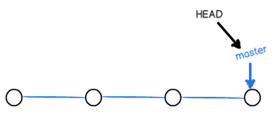

创建分支：

```
$ git branch <name>
$ git branch 分支名称
```

#### 3.5.4 切换分支 

```
$ git checkout <name>
```

#### 3.5.5 创建+切换分支

```
$ git checkout -b <name>
```

#### 3.5.6 推送至远程仓库分支 

推送分支，就是把该分支上的所有本地提交推送到远程库，推送时要指定本地分支，这样，git就会把该分支推送到远程库对应的远程分支上

```
$ git push origin 分支名称 
例：
git push origin smart
```

#### 3.5.7 从远程分支上拉取代码

```
git pull orgin 分支名称
例：
git pull orgin smart
```

使用上述命令会把远程分支smart上的代码下载并合并到本地所在分支。

#### 3.5.8 将本地分支跟踪服务器分支

```
git branch --set-upstream-to=origin/远程分支名称 本地分支名称
例：
git branch --set-upstream-to=origin/smart smart
```

#### 3.5.9 合并分支 

有时候合并操作不会如此顺利。 如果你在两个不同的分支中，对同一个文件的同一个部分进行了不同的修改，Git 就没办法合并它们，同时会提示文件冲突。git用<<<<<<<，=======，>>>>>>>标记出不同分支的内容。此时需要我们打开冲突的文件并修复冲突内容，最后执行git add命令来标识冲突已解决

```
$ git merge branchName 
$ git add 文件名称 
$ git push origin master #推送分支
```

通常，合并分支时，如果可能，git会用fast forward模式，但是有些快速合并不能成而且合并时没有冲突，这个时候会合并之后并做一次新的提交。但这种模式下，删除分支后，会丢掉分支信息。

#### 3.5.10 删除分支

删除分支删除的是本地的分支，远程分支不会受到影响。

```
$ git branch -d branchName 
```

如果要删除的分支中进行了一些开发动作，此时执行上面的删除命令并不会删除分支，如果坚持要删除此分支，可以将命令中的-d参数改为-D

```
$ git branch -D branchName 
```

注：如果要删除远程仓库中的分支，可以使用命令git push


```
$ git push origin –d branchName  
```

#### 3.5.11 Bug分支 

软件开发中，bug就像家常便饭一样。有了bug就需要修复，在git中，由于分支是如此的强大，所以，每个bug都可以通过一个新的临时分支来修复，修复后，合并分支，然后将临时分支删除。

(1)当你接到一个修复一个代号001的bug的任务时，很自然地，你想创建一个分支bug-001来修复它，但是，等等，当前正在dev上进行的工作还没有提交

并不是你不想提交，而是工作只进行到一半，还没法提交，预计完成还需1天时间。但是，必须在两个小时内修复该bug，怎么办？

(2)git还提供了一个stash功能，可以把当前工作现场“储藏”起来，等以后恢复现场后继续工作：

```
$ git stash
```

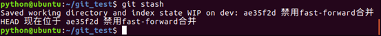

(3)首先确定要在哪个分支上修复bug，假定需要在master分支上修复，就从master创建临时分支：

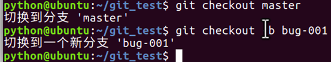

(4)现在修复bug,把 the new line删掉，然后提交。

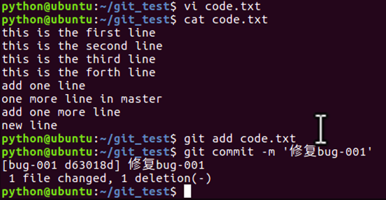

(5)修复完成后，切换到master分支，并完成合并，最后删除bug-001分支。

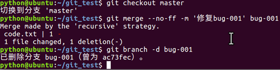

(6)现在bug-001修复完成，是时候接着回到dev分支干活了！

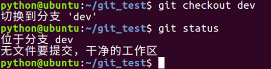

(7)工作区是干净的，刚才的工作现场存到哪去了？用git stash list命令看看：

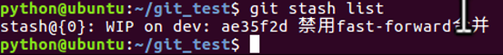

作现场还在，git把stash内容存在某个地方了，但是需要恢复一下。修复后，再git stash pop，恢复工作现场。


### 3.6 Git标签

像其他版本控制系统（VCS）一样，Git 可以给历史中的某一个提交打上标签，以示重要。 比较有代表性的是人们会使用这个功能来标记发布结点（v1.0 、v1.2等）。标签指的是某个分支某个特定时间点的状态。通过标签，可以很方便的切换到标记时的状态。

#### 3.6.1 列出已有的标签

```
$ git tag
```

#### 3.6.2 查看tag信息

```
$ git show [tag]
```

#### 3.6.3 创建新标签

```
$ git tag [tagName]
```

#### 3.6.4 将标签推送至远程仓库

```
$ git push [remote] [tag] # 提交指定tag
$ git push origin v0.1
```

#### 3.6.5 检出标签

```
$ git checkout -b [branch] [tag] # 新建一个分支，指向某个tag
```

#### 3.6.6 删除标签

```
$ git tag -d [tag] # 删除本地tag
```

#### 3.6.7 删除远程标签

```
$ git push origin :refs/tags/[tag] # 删除远程tag
```

## 四、使用TortoiseGit管理文件版本

### 4.1 创建仓库

直接右键点击 Git Create repository here 不用勾选，选择创建空文件夹

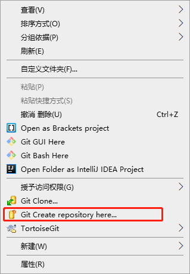


### 4.2 克隆仓库

文件夹中右键点击 Git Clone,输入需要克隆的项目地址即可

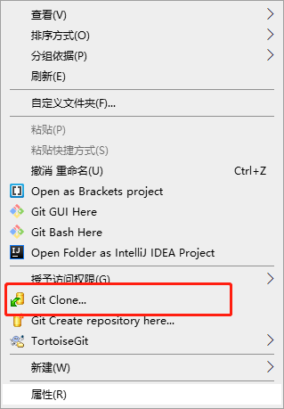

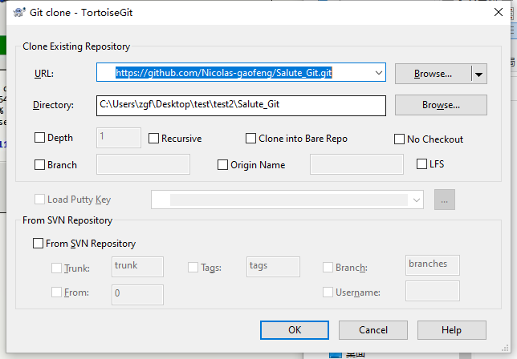

### 4.3 将文件添加到暂存区

右键文件，选择add

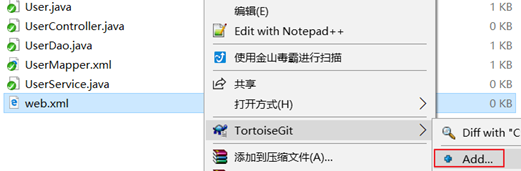


### 4.4 提交文件

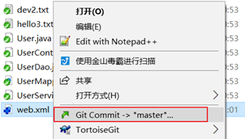

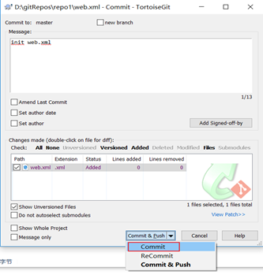

### 4.5 推送本地仓库至远程仓库

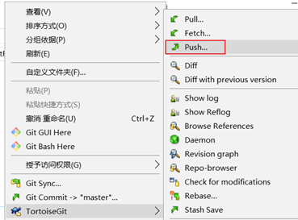

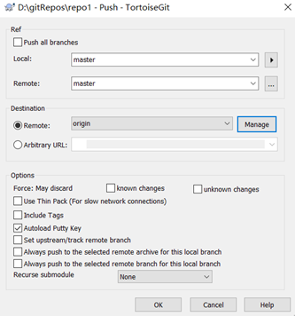

### 4.6 拉取代码

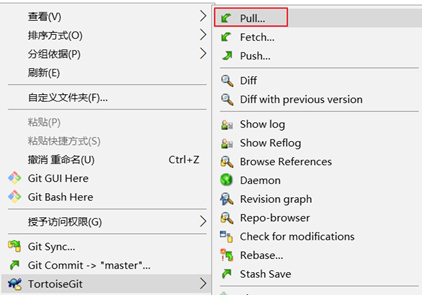

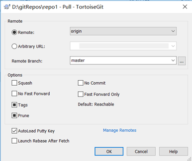

### 4.7 创建分支

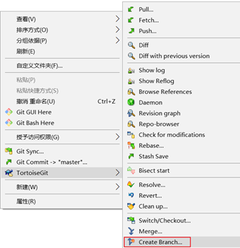


### 4.8 切换分支

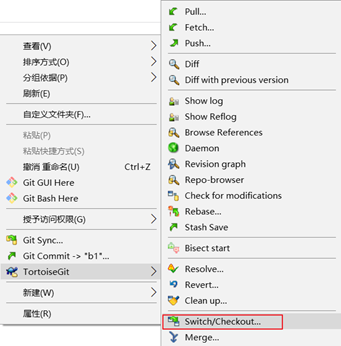

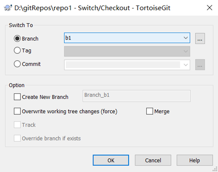

### 4.9 合并分支

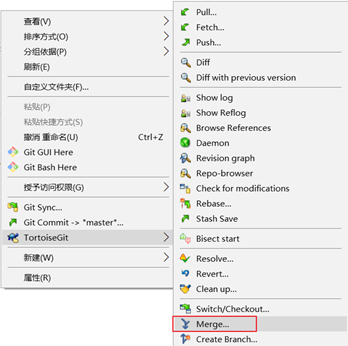


## 五、在IDEA中使用Git 

### 5.1 在IDEA中配置Git 

安装好IntelliJ IDEA后，如果Git安装在默认路径下，那么idea会自动找到git的位置，如果更改了Git的安装位置则需要手动配置下Git的路径。

选择File→Settings打开设置窗口，找到Version Control下的git选项：

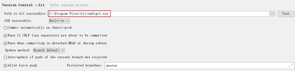

选择git的安装目录后可以点击“Test”按钮测试是否正确配置

​                       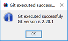

### 5.2 在IDEA中使用Git

#### 5.2.1 在IDEA中创建工程并将工程添加至Git 

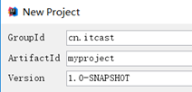

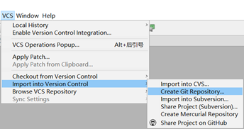

将项目添加至Git管理后，可以从IDEA的工具栏上看到Git操作的按钮

#### 5.2.2 将文件添加到暂存区

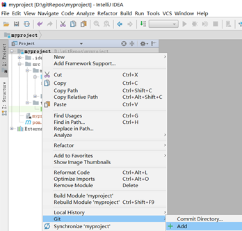

#### 5.2.3 提交文件 

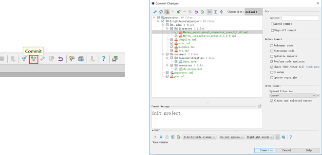

#### 5.2.4 将代码推送到远程仓库 

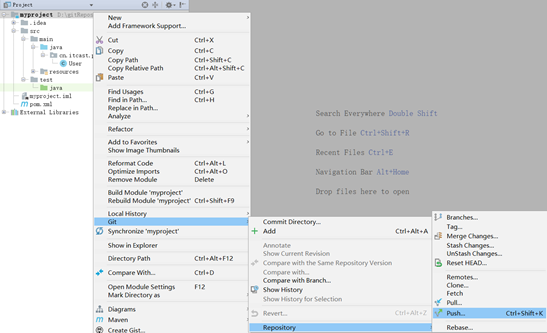

#### 5.2.5 从远程仓库克隆工程到本地

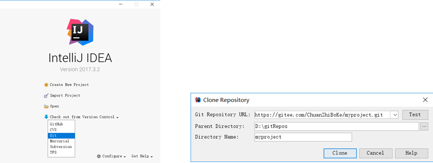

#### 5.2.6 从远程拉取代码

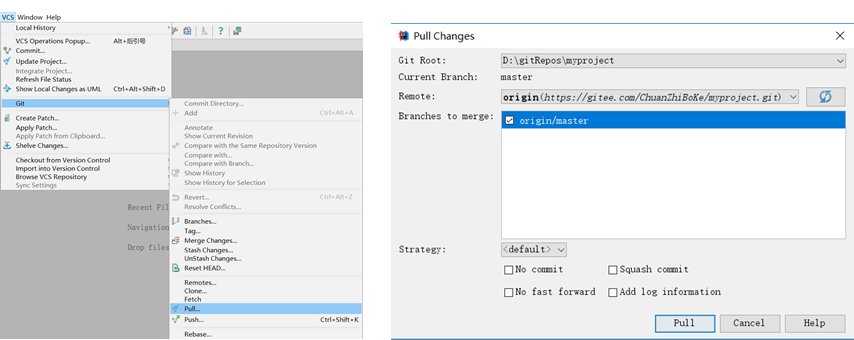

#### 5.2.7 版本对比

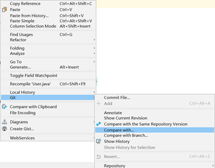

#### 5.2.8 创建分支 

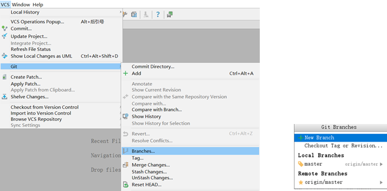

#### 5.2.9 切换分支

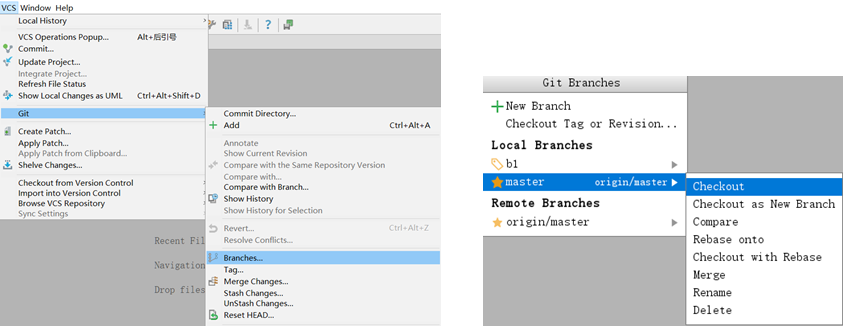

#### 5.2.10 分支合并

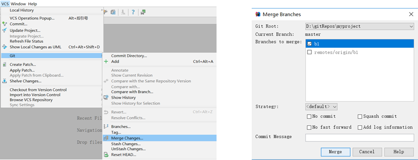

## 六、使用SSH协议传输数据

### 6.1 Git支持的传输协议

由于Git的远程仓库并不在我们本地，当我们在使用远程仓库的时候（例如克隆、拉取、推送）就会涉及到数据的网络传输，Git支持多种数据传输协议

- 本地协议（Local）
- HTTPS 协议
- SSH（Secure Shell）协议
- Git 协议

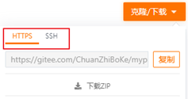

### 6.2 什么是SSH协议

SSH 为 Secure Shell（安全外壳协议）的缩写，由 IETF 的网络小组（Network Working Group）所制定。SSH 是目前较可靠，专为远程登录会话和其他网络服务提供安全性的协议。利用 SSH 协议可以有效防止远程管理过程中的信息泄露问题。

由于本地Git仓库和远程仓库之间的传输是通过SSH加密的，所以必须要让远程仓库服务器认证你的SSH key，在此之前，必须要生成SSH key。

使用ssh协议通信时，推荐使用基于密钥的验证方式。你必须为自己创建一对密匙（公钥和私钥），并把公匙放在需要访问的服务器上。

### 6.3 配置SSH协议

可以使用Git提供的命令行工具Git Bash生成公钥和私钥，具体操作过程如下：

1、使用命令ssh-keygen –t rsa生成公钥和私钥，执行完成后在window本地用户.ssh目录C:\Users\用户名\.ssh下面生成如下名称的公钥和私钥

```
ssh-keygen –t rsa
ssh-keygen -t rsa -C "邮箱地址"
```

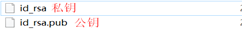

2、复制公钥文件内容至码云服务器

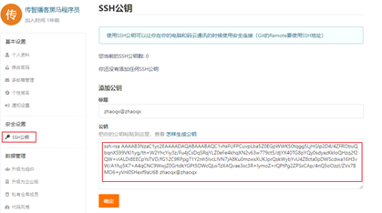

## 七、使用GitHub

### 7.1 创建仓库

(1)注册github账户，登录后，点击"New respository "

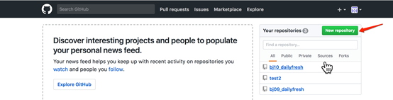

(2)在新页面中，输入项目的名称，勾选'README.md'，点击'create repository'

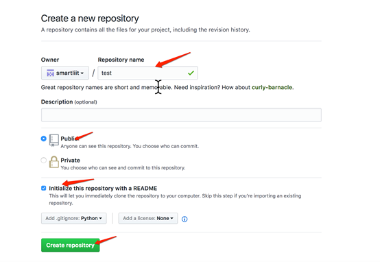

(3)添加成功后，转到文件列表页面.

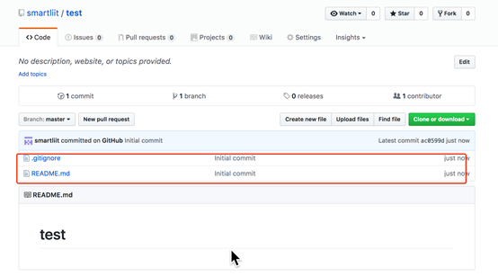

### 7.2 添加ssh账户

(1) 如果某台机器需要与github上的仓库交互，那么就要把这台机器的ssh公钥添加到这个github账户上。点击账户头像后的下拉三角，选择'settings'。

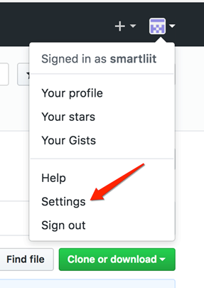

点击'SSH and GPG keys'，添加ssh公钥。

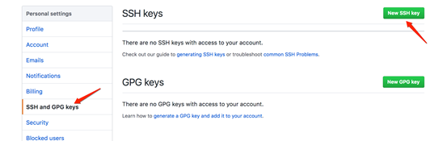

(2)在ubuntu的命令行中，回到用户的主目录下，编辑文件.gitconfig，修改某台机器的git配置。


(3)修改为注册github时的邮箱，填写用户名。


(4)使用如下命令生成ssh密钥。

```
ssh-keygen -t rsa -C "邮箱地址"
```


(5)进入主目录下的.ssh文件件，下面有两个文件。

公钥为id_rsa.pub

私钥为id_rsa

查看公钥内容，复制此内容


(6)回到浏览器中，填写标题，粘贴公钥


### 7.3 自动生成README.md目录

由于码云和github的markdown解析器，都不支持 [TOC]，码云官方推荐的是使用<a>标签来生成目录，但是如果文档目录过多，这种方式显然很不现实。

[gh-md-toc](https://github.com/ekalinin/github-markdown-toc.go/releases)

首先将README.md文档复制到[gh-md-toc.exe](./gh-md-toc.exe)的根目录下。

接着按住shift键同时右击。


打开Powershell窗口后，直接键入。

```bash
./gh-md-toc.exe README.md
```

然后将生成的这一大段内容粘贴到你的md文件中，上传到码云或github即可显示目录

### 7.4 怎么删除某个文件夹

在github上只能删除仓库,却无法删除文件夹或文件, 所以只能通过命令来解决

首先进入你的master文件夹下, Git Bash Here ,打开命令窗口

```
$ git --help                                      # 帮助命令
$ git pull origin master                    # 将远程仓库里面的项目拉下来
$ dir                                                # 查看有哪些文件夹
$ git rm -r --cached target              # 删除target文件夹
$ git commit -m '删除了target'        # 提交,添加操作说明
$ git push -u origin master # 将本次更改更新到github项目上去
```

注:本地项目中的target文件夹不收操作影响,删除的只是远程仓库中的target, 可放心删除
每次增加文件或删除文件，都要commit 然后直接 git push -u origin master，就可以同步到github上了

## 八、工作使用git

**项目经理：**

(1)   项目经理搭建项目的框架。

(2)   搭建完项目框架之后，项目经理把项目框架代码放到服务器。

**普通员工：**

(1)  在自己的电脑上，生成ssh公钥，然后把公钥给项目经理，项目经理把它添加的服务器上面。

(2)  项目经理会给每个组员的项目代码的地址，组员把代码下载到自己的电脑上。

(3)  创建本地的分支dev,在dev分支中进行每天的开发。

(4)  每一个员工开发完自己的代码之后，都需要将代码发布远程的dev分支上。

项目里通常会添加两个分支：

Master:用户保存发布的项目代码。V1.0,V2.0

Dev:保存开发过程中的代码。
